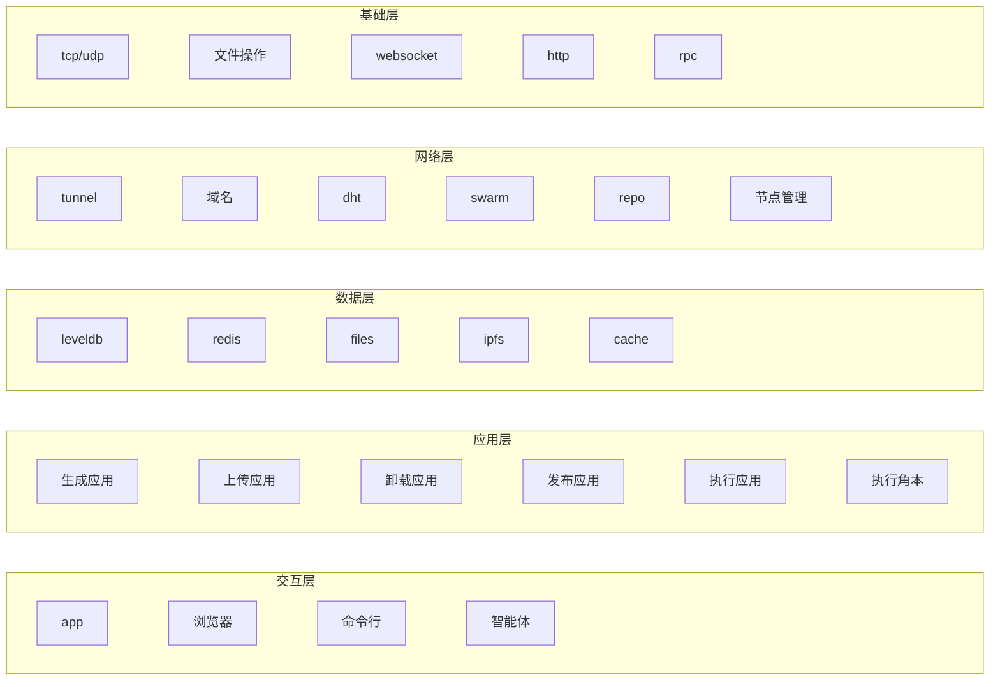

# Leither技术架构图

```mermaid
flowchart TD
    subgraph 基础层
        direction LR
        style 基础层 width:1200px,text-align:left
        A[tcp/udp] --- B[文件操作]
        B --- C[websocket]
        C --- D[http]
        D --- E[rpc]
        linkStyle 0,1,2,3 stroke:transparent,stroke-width:0px
    end

    subgraph 网络层
        direction LR
        style 网络层 width:1200px,text-align:left
        F[tunnel] --- G[域名]
        G --- H[dht]
        H --- I[swarm]
        I --- J[repo]
        J --- K[节点管理]
        linkStyle 4,5,6,7,8 stroke:transparent,stroke-width:0px
    end

    subgraph 数据层
        direction LR
        style 数据层 width:1200px,text-align:left
        L[leveldb] --- M[redis]
        M --- N[files]
        N --- O[ipfs]
        O --- P[cache]
        linkStyle 9,10,11,12 stroke:transparent,stroke-width:0px
    end

    subgraph 应用层
        direction LR
        style 应用层 width:1200px,text-align:left
        Q[生成应用] --- R[上传应用]
        R --- S[卸载应用]
        S --- T[发布应用]
        T --- U[执行应用]
        U --- V[执行角本]
        linkStyle 13,14,15,16,17 stroke:transparent,stroke-width:0px
    end

    subgraph 交互层
        direction LR
        style 交互层 width:1200px,text-align:left
        W[app] --- X[浏览器]
        X --- Y[命令行]
        Y --- Z[智能体]
        linkStyle 18,19,20 stroke:transparent,stroke-width:0px
    end

    基础层 --> 网络层
    网络层 --> 数据层
    数据层 --> 应用层
    应用层 --> 交互层
    linkStyle 21,22,23,24 stroke:transparent,stroke-width:0px
```