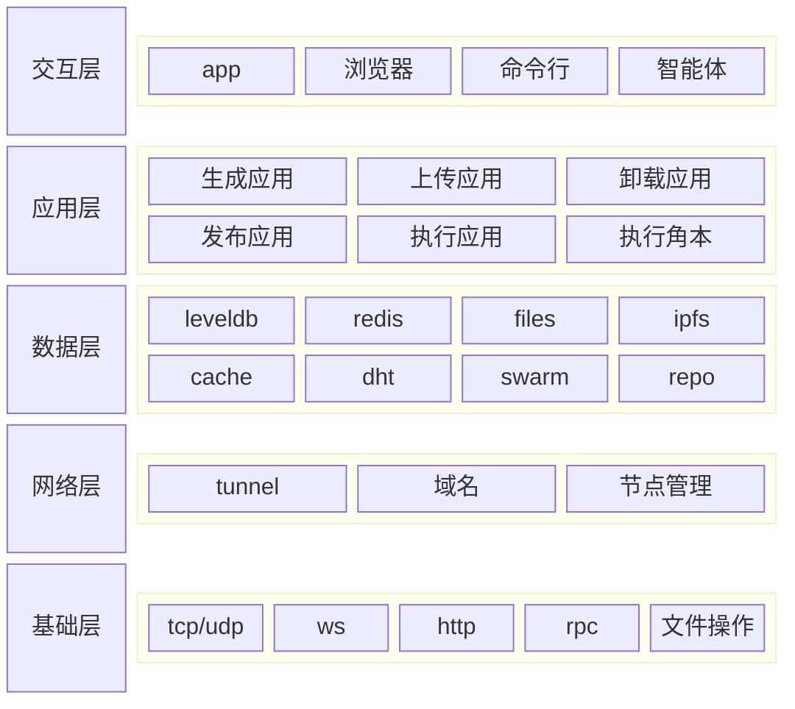

```mermaid
block-beta
columns 6
    交互层:1
    block:ID0:5
        app 浏览器 命令行 智能体
    end
    应用层:1
    block:ID1:5
        columns 3
        生成应用 上传应用 卸载应用
        发布应用 执行应用 执行角本    
    end
    数据层:1
    block:ID2:5
        columns 4
        leveldb redis files ipfs
        cache dht swarm repo
    end
    网络层:1
    block:ID3:5
        tunnel 域名 dht swarm repo 节点管理
    end
    基础层:1
    block:ID4:5
        tcp/udp ws http rpc 文件操作
    end

```